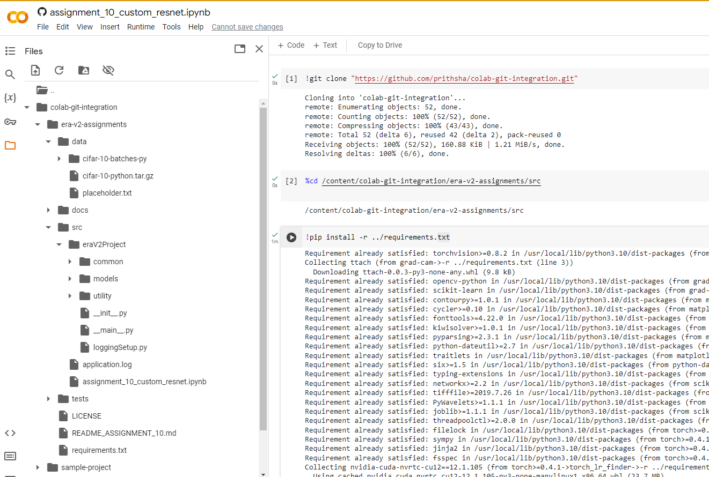

Repository proposes what can be possible source folder structure while using Jupyter notebooks with large source code.
This proposal allow to run Jupyter notebook locally, on google colab and also allow to run package independently. 

# Runing Jupyter notebook in google colab and maintaining complex source code structure for Jupyter notebook in git
Example repo to proposes git folder structure having one or multiple jupyter notebooks which are possible to run locally or on google colab

Proposed source code structure:

```console

- Repo/Project folder
    |- src
        |- package(sampleProject)
            |- __main__.py
            |- common
            |- models
            |- utility
        |- Jupyter notebooks
    |- tests
    |- docs
    |- README
    |- requirements.txt


```


Jupyter notebooks needs to be placed at package level 

## Running the package and Jupyter notebook 

- Use absolute import like : from sampleProject.utility import myUtility everywhere in code and same absolute reference in Jupyter notebook


### Running the package independent from notebook 

Go to /src

> python -m sampleProject


### Running the Jupyter notebook

- You can reference any module as run as you want


## Importing and running Jupyter notebook in google colab

1. Use git repo HTTPS link to search for jupyter notebook file in google colab
2. Open the Jupyter file and clone repository by adding following code line in starting:
    - !git clone "https://github.com/some-repo.git"
3. Now we have downloaded the complete repo. But to execute Jupyter notebook, notebook should be able to find correct package. So current location should be specific directory inside source where Jupyter notebook can references the package
    - %cd /content/colab-git-integration/<repo-name>/src

4. Install the requirements 
    - !pip install -r ../requirements.txt

5. Now you should be able to execute rest of the jupyter notebook program.



### Directly running code without any modification 

- For this your repo should have only contents present inside /src at repo level. So when you clone git repo, you may not need to change any path. Not tried but it should work.
- Execute above steps 4 and 5 as needed.


